# Adopt Me

Adopt Me is a fictional advertisement website for dog adoption purposes. The app is designed to allow registered to easily make advertisements and manage them.
The live link can be found here: [Live Site - Adopt Me](https://pp4-adopt-me-7acd5b9ef50f.herokuapp.com/)


## Table of Contents
- [Adopt Me](#adope-me)
  - [Table of Contents](#table-of-contents)
- [User-Experience-Design](#user-experience-design)
  - [The-Strategy-Plane](#the-strategy-plane)
    - [Site-Goals](#site-goals)
    - [Agile Planning](#agile-planning)
      - [Epics](#epics)
      - [User Stories](#user-stories)
  - [The-Scope-Plane](#the-scope-plane)
  - [The-Structure-Plane](#the-structure-plane)
    - [Features](#features)
    - [Features Left To Implement](#features-left-to-implement)
  - [The-Skeleton-Plane](#the-skeleton-plane)
    - [Wireframes](#wireframes)
    - [Database-Design](#database-design)
    - [Security](#security)
  - [The-Surface-Plane](#the-surface-plane)
    - [Design](#design)
    - [Colour-Scheme](#colour-scheme)
    - [Typography](#typography)
    - [Imagery](#imagery)
  - [Technolgies](#technolgies)
    - [Languages Used](#languages-used)
    - [Python Modules](#python-modules)
    - [Technologies & Programs](#technologies--programs)
  - [Testing](#testing)
  - [Deployment](#deployment)
    - [Version Control](#version-control)
    - [Heroku Deployment](#heroku-deployment)
    - [Run Locally](#run-locally)
    - [Fork Project](#fork-project)

# User-Experience-Design

## The-Strategy-Plane

### Site-Goals

The site goal is for registered website users to upload adverts of dogs they would like to put up for adoption. Advert owners can publish, edit and delete their advert with ease.

The site also aims to provide regular site users with the ability to browse freely through the uploaded adverts.

### Agile Planning

This project was developed using agile methodologies by using the MoSCoW prioritization with the aim of improving quality in rapid app development (RAD) processes.

All projects were assigned to epics, prioritized under Must have, Should Have, Could Have and Won't Have labels.

The Kanban board was created using github projects and can be located [here](https://github.com/erincunningham7/pp4-project-portfolio-four/projects?query=is%3Aopen) and can be viewed to see more information on individual project cards.


### Epics

The project has three main epics (milestones):

1. Developer set up
The developer setup milestone involves anything to do with setting up the development environment.

2. Adoption
The adoption milestone involves anything that relates to the CRUD for advertising animals.

3. Authentication
The authentication milestone involves anything associated with checking a user's identity.

### User Stories

The following outlines the user stories (by epic):

1. Developer set up
- As a developer I can create the base.html template so that other html pages can reuse the layout
- As a developer I can add statis resources so that the css, javascript and images work effectively on the platform
- As a developer I can add a 404 error page so that site users are alerted when they have accessed a page that does not exist

2. Adoption
- As a site user I can view a list of adverts so that so that I can browse through them
- As a site visitor I can view the advertisements so that browse through the adoption ads
- As a site user I can create an advertisement so that I can upload the animals information to potential new adopters
- As a site user I can edit or delete an advert so that I can change or remove my submitted ad content
- As a site user I can view the about page so that I can read what the website is about

3. Authentication
- As a site visitor I can register for an account so that I can log in and out of the website
- As a admin I can login to the admin panel so that I can manage the website

## The Scope Plane

- Responsive Design: website should be fully functional on all devices from 320px up
- Hamburger menu for mobile devices
- Ability to perform CRUD functionality on adverts
- Restricted role based features
- About page with website information#

## The Structure Plane

### Features

**Navigation Menu**

The navigation menu contains links for Home, About Us, Create Advert and has allauth options.

The following navigation items are available on all pages:
  * Home -> index.html - Visible to all
  * About Us -> about.html - Visible to all
  * Create Advert -> create_ad.html - Visible to registered users
  * Login -> login.html - Visible to logged out users
  * Register -> signup.html - Visible to logged out users
  * Logout -> logout.html - Visible to logged in users

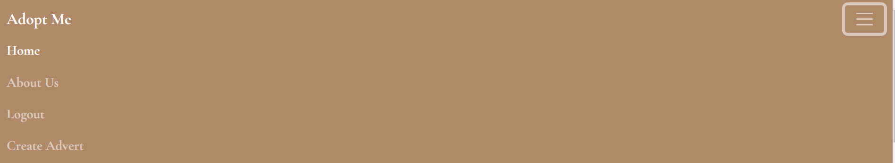

**Home Page**

For unregistered users, when they are directed to the site, the home page displays the about page. Urging the users to either register for an account or login, and defining the purpose of the site for new visitors.

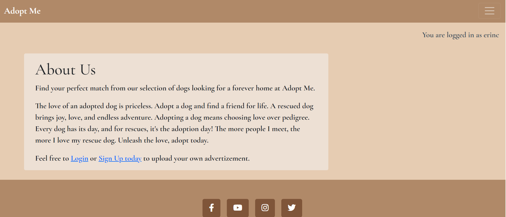

For loggin in users, the home page consists of a paginated list of advertisements, each containing a title, image, date and time on which the ad was uploaded and a small excerpt.

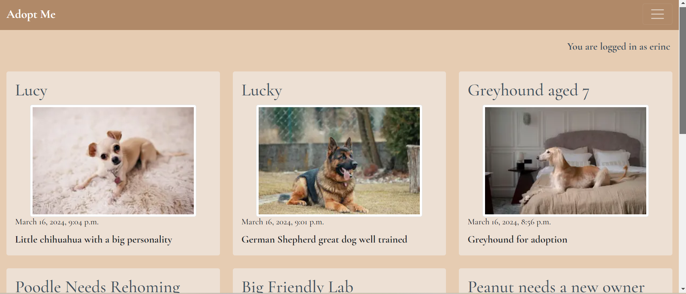

**Ad Detail Page**

When a user clicks on an advert, they are redirected to an in depth look at the dog's details. They can see important information regarding the pet and the owners phone number for contact purposes. If the user viewing the advert is the owner of the ad they have the option to edit or delete the advert via the edit and delete buttons.

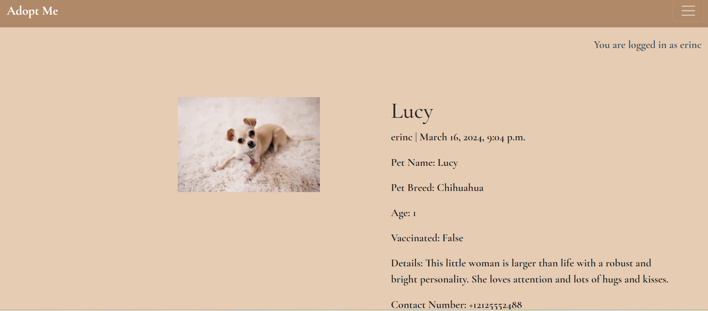

**Footer**

A footer has been added to the bottom of the site, this contains Facebook, Youtube, Instagram and Twitter links. These icons have aria-labels to make sure users with assistive screen reading technology know what the links are for. The links open in a new tab. A copyright has also been added to the footer.


**Create Advert page**

The create advert page displays a form with various fields for the registered user to fill out. Mandatory fields are marked with a *.

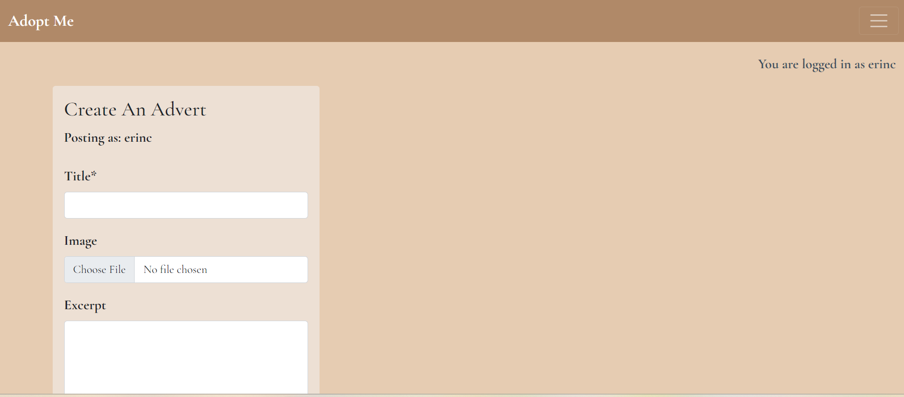

**Edit Advert Page**

When an advert owner clicks the edit button on their advert detail page, they are redirected to the form they previously submitted containing all the information they previously added. They can edit any field and simply click the update button afterwards.

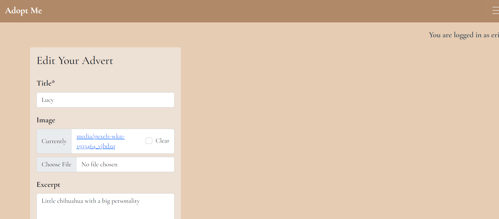

**Delete Advert Page**

When an advert owner clicks the delete button on their advert detail page, they are redirected to the delete advert page, where the advert owner can confirm whether they want to delete the page or cancel.

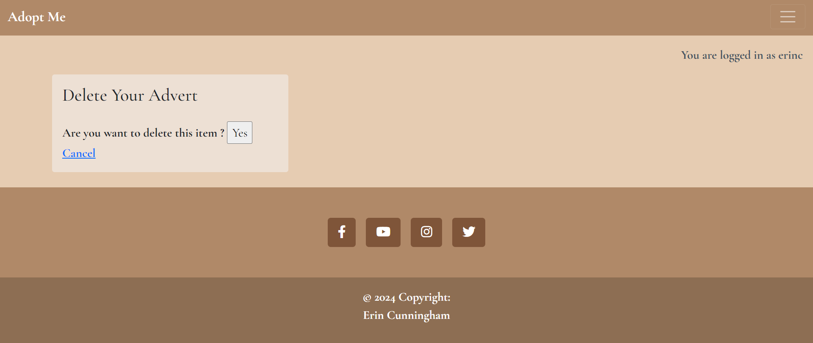

**Toasts**

There are several alert messages across the website, that appear momentarily and disappear shortly thereafter, eg. when a user edits or deletes an ad, when a user logs in or out.

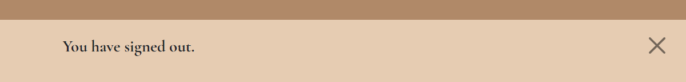

**404 Page**

I implemented an 404 error page to redirect users to if a user clicks on a broken link.
The page allows users to easily navigate back to the main website if they direct to a broken link.

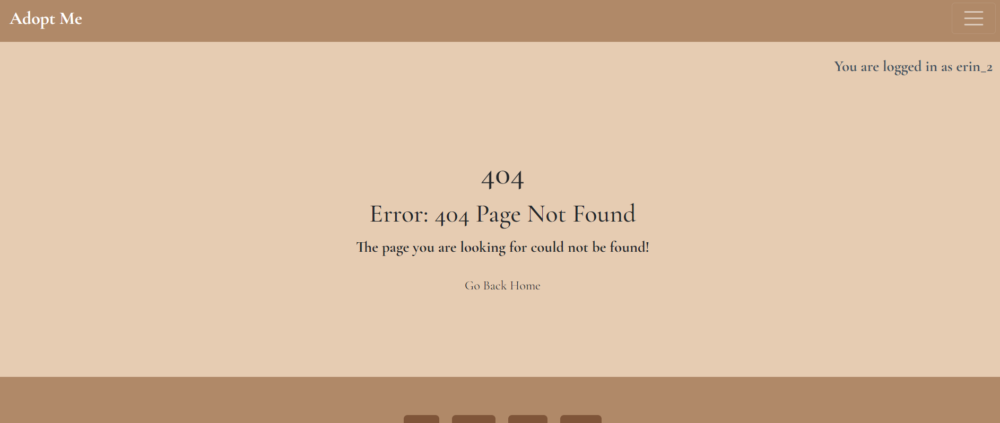

**Personalized Message**

A personalized messages appears on the right hand corner of the page, confirming whether a user is logged in or not. If they are logged in, it displays their username too.

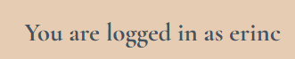

### Features Left To Implement

In the future I would like to implement a contact form for users to contact the advert owners. I would also like to add customized user profiles containing a profile picture and a bio. Lastly, I would like to implement comments on advert posts. 

## The-Skeleton-Plane

### Wireframes

- Home page

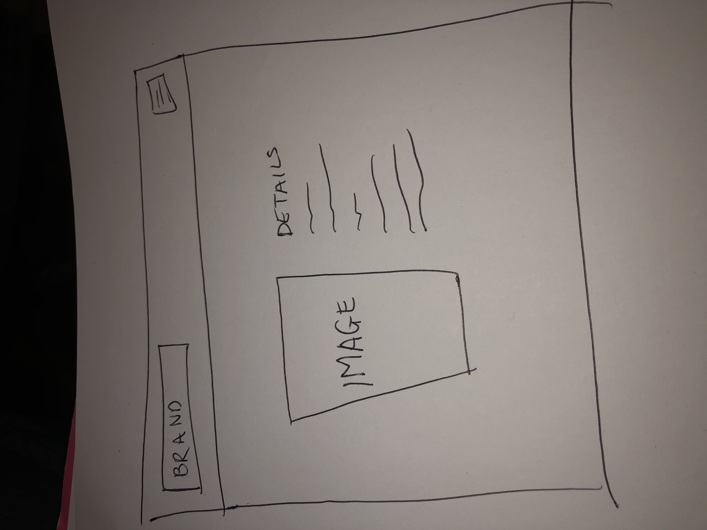

- Ad detail page

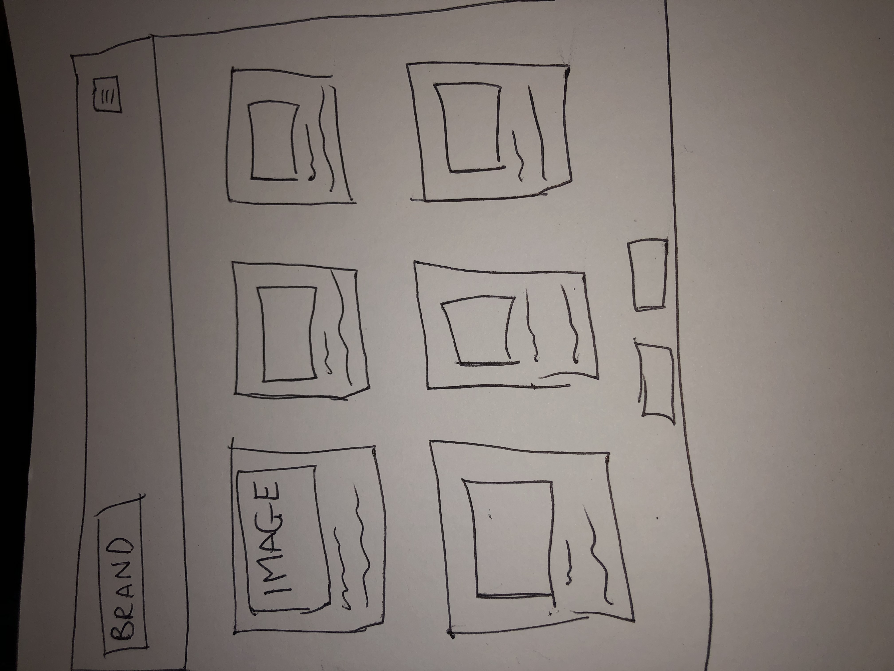

### Database-Design

The database was designed with user CRUD functionality in mind for registered users, when signed in. The user model is the backbone of the application as it is connected the the main advert model, linked by a primary/foreign key relationship.


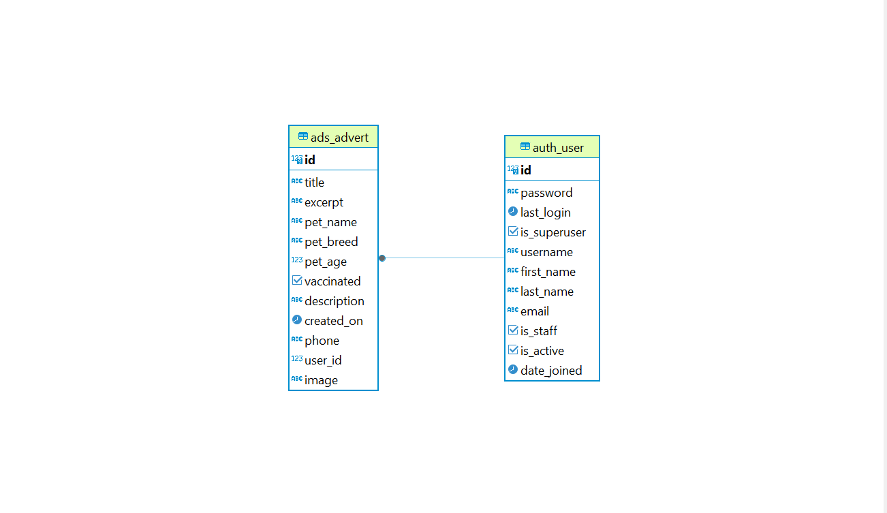

### Security

Environment variables were kept in the env.py for security reasons, mainly to make sure that no sensitive information was added the the public repository. In production, these variables were added to the heroku config vars.

Views were secured by adding if statement to ensure if users are not ad owners they are not capable of editing or deleting an advert.

## The-Surface-Plane
### Design

### Colour-Scheme

I used a [color palette](https://coolors.co/palettes/trending) I found online to create a color scheme on the website. According to color psychology, brown invokes feelings of loneliness, sadness, and isolation. I wanted to invoke these feelings in website visitors in the hopes they would be more inclined to adopt a dog. I also thimk brown represents nature.

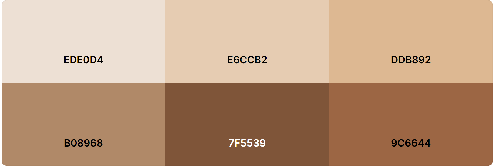

### Typography

The "Cormorant Garamond" font was used throughout the website. This font is from google fonts.

### Imagery

All images were taken from [a free image site](https://www.pexels.com/).

## Technolgies

### Languages Used

- HTML
- CSS
- Javascript
- Python
- Django
- Bootstrap

### Python Modules

- cloudinary==1.36.0 - used for custom image uploads
- crispy-bootstrap5==0.7 - used for bootstrap forms
- dj-database-url==0.5.0 - used to parse database url for production environment
- django-resized==1.0.2 - used for image resizing
- django-summernote==0.8.20.0 - used for WYSIWYG editing
- gunicorn==20.1.0 - installed as dependency with another package
- pillow==10.2.0 - used for image upload purposes
- whitenoise==5.3.0 - Used to serve static files

### Technologies & Programs

- The Code Institute I Think Therefore I Blog Walkthrough was used as a basic outline for the website
- [DBeaver was used to make the ERD](https://dbeaver.com/2022/06/30/two-ways-to-use-erd-in-dbeaver/)
- [This tutorial helped in figuring out how to upload images successfully](https://djangocentral.com/uploading-images-with-django/)

## Testing

|Section|Test Action|Expected Result|Pass/Fail|Comments|
| ---| ---| ---| ---| ---|
|Navbar|Click on Title in Navbar|Redirect to Home |Pass| |
||Click on the links in Navbar|Redirect to correct page |Pass|Navbar present on all pages | |
|Ad detail page| Click on the advert link. Ensure it redirects to the correct single advert detail page |When clicked each card redirects to the correct single advert page |Pass| |
|Edit advert page| Click on the edit advert button. Ensure it redirects to the edit advert page |When clicked the edit button redirects to the edit advert page|Pass| |
|Delete advert page| Click on the delete advert button. Ensure it redirects to the delete advert page |When clicked the delete button redirects to the edit advert page|Pass| |
|Sign up| Click register, enter username and password | registration succesful |Pass| |
|Login| Click login, enter username and password | login succesful |Pass| |
|Footer|Click on all of the social links in the footer. Ensure each external link opens the correct page in a new tab |All external links open the correct page in a new tab |Pass| |
|Responsiveness|Test pags to ensure responsiveness on all browsers|Website behaves as expected |Pass| |
|Messages|Click on sign out|Message appears and timer works |Pass| |
|Personalized message|Click on login, enter username and password|Personalized message appears |Pass| |

**Navigation Links**

Testing was performed to ensure all navigation links on the respective pages, navigated to the correct pages as per design. This was done by clicking on the navigation links on each page.

- Home -> index.html
- About Us -> about.html
- Create Advert -> create_ad.html
- Logout -> Sign out all auth page
- Login -> Sign in all auth page
- Register -> Sign up all auth page

All navigation links directed to the corect pages as expected.

**Footer**

Testing was performed on the footer links by clicking the font awesome icons and ensuring that the icons opened in their respective tabs. These behaved as expected.

**Negative Testing**

Tests were performed on the create booking to ensure that:

1. A user cannot edit someone elses advert
2. A user cannot delete someone elses adert
3. An unregistered user cannot create an advert
4. Forms cannot be submitted when required fields are empty

* HTML Validation

All Html files were tested for validation. Initially there were some errors due to misuse of buttons appearing as decsendents of link elements. These issues were corrected and all pages passed validation.

Due to the django templating language code used in the HTML files, these could not be simply copy and pasted into the validator. To test the validation on the files, I opened the page I wanted to validate, and right clicked and selected view page source. I had to paste the raw html code into the validator as this would display be only the HTML rendered code.

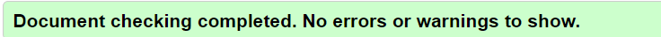

* Python Linter

All python files were passed through the ci python linter. Initially there were a couple of errors were shown due to lines too long, blank spaces, 1 line instead of 2 expected. All of these errors were fixed and in the end the code passed through validators.

In the settings.py file, the django auto generated code for AUTH_PASSWORD_VALIDATORS were showing errors for lines too long. I couldnt find a way to split these lines to resolve the error. This was not my code as they were auto-generated.

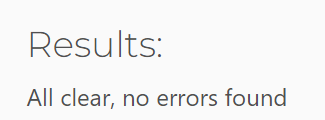

* Wave Accessibility

All pages were checked for accessibility errors.

Testing was done to ensure the following criteria were met:

- No errors are present
- No color contrasts errors are present

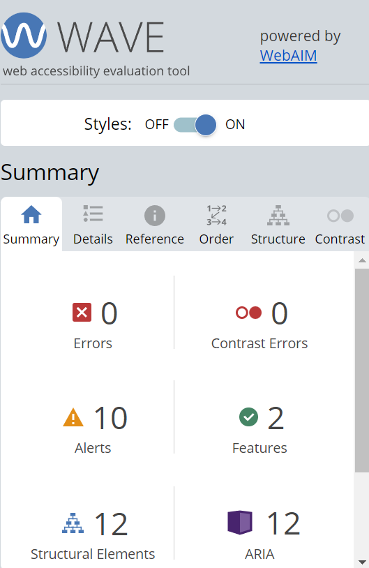

## Deployment

### Version Control

The Adopt Me website was created using Gitpod and pushed to github to the remote repository ‘pp4-project-portfolio-four’.

The following git commands were used religiously throughout the website's development to push code to the remote repo:

```git add .``` - This command was used to add the changed file(s) to the staging area before they were committed to the local repository.

```git commit -m “commit message”``` - This command was used to commit the changes to the remote repo queue ready for the last step in the process.

```git push``` - This command was used to push all of the committed code to the repository on github.

### Heroku Deployment

The site was deployed to Heroku. The steps for deployment are as followed:

- Go to Heroku website and create a registered account
- Click the 'new' button in the top right corner
- Select 'create new app'
- Enter the application name
- Select region and click the create app button
- Navigate to the settings tab and click on 'reveal config vars'
- Add the following config vars:
  - SECRET_KEY: (Your secret key)
  - DATABASE_URL: (This should already exist with add on of postgres)
  - CLOUNDINARY_URL: (cloudinary api url)
- Navigate to the deploy tab
- Click the deploy tab
- Scroll down to 'connect to GitHub' and sign in to your Github account
- Using the search box, find the Github repository you want to deploy and click the 'connect' button
- Scroll down to the manual deploy section and choose the main branch
- Click deploy

The app should now be deployed.

The live link can be found here: [Live Site](https://pp4-adopt-me-7acd5b9ef50f.herokuapp.com/)

### Run Locally

Open Github and go to the GitHub repository you would like to clone to use locally:

- Click on the 'code' button
- Click on HTTPS
- Copy the repository link
- Open your IDE (git must be installed for the following steps)
- Type git clone copied-git-url into the IDE terminal

The project will now have been cloned on your local machine for use.

### Fork Project

Forks are usually used to either propose changes to someone else's project or to use someone else's project as a base for your own website idea.

- Open Github

- Go to the GitHub Repository you want to fork

- On the top right corner of the page underneath the header, click the 'fork' button

- This will create a copy of the project in your GitHub repository
