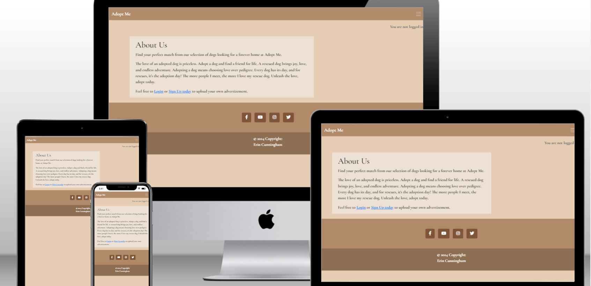
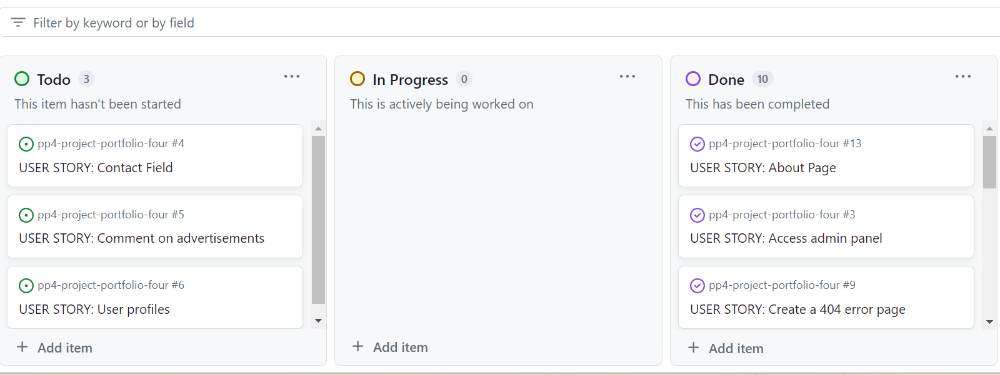

# Adopt Me

Adopt Me is a fictional advertisement website for dog adoption purposes. The app is designed to allow registered to easily make advertisements and manage them.
The live link can be found here: [Live Site - Adopt Me](https://pp4-adopt-me-7acd5b9ef50f.herokuapp.com/)



# User-Experience-Design

## The-Strategy-Plane

### Site-Goals

The site goal is for registered website users to upload adverts of dogs they would like to put up for adoptio. Advert owners can publish, edit and delete their advert with ease.

The site also aims to provide regular site users with the ability to browse freely through the uploaded adverts.

### Agile Planning

This project was developed using agile methodologies by using the MoSCoW prioritization with the aim of improving quality in rapid app development (RAD) processes.

All projects were assigned to epics, prioritized under Must have, Should Have, Could Have and Won't Have labels.

The Kanban board was created using github projects and can be located [here](https://github.com/erincunningham7/pp4-project-portfolio-four/projects?query=is%3Aopen) and can be viewed to see more information on individual project cards.



### Epics

The project has three main epics (milestones):

1. Developer set up
The developer setup milestone involves anything to do with setting up the development environment.

2. Adoption
The adoption milestone involves anything that relates to the CRUD for advertising animals.

3. Authentication
The authentication milestone involves anything associated with checking a user's identity.

### User Stories

The following outlines the user stories (by epic):

1. Developer set up
- As a developer I can create the base.html template so that other html pages can reuse the layout
- As a developer I can add statis resources so that the css, javascript and images work effectively on the platform
- As a developer I can add a 404 error page so that site users are alerted when they have accessed a page that does not exist

2. Adoption
- As a site user I can view a list of adverts so that so that I can browse through them
- As a site visitor I can view the advertisements so that browse through the adoption ads
- As a site user I can create an advertisement so that I can upload the animals information to potential new adopters
- As a site user I can edit or delete an advert so that I can change or remove my submitted ad content
- As a site user I can view the about page so that I can read what the website is about

3. Authentication
- As a site visitor I can register for an account so that I can log in and out of the website
- As a admin I can login to the admin panel so that I can manage the website

## The Scope Plane

- Responsive Design: website should be fully functional on all devices from 320px up
- Hamburger menu for mobile devices
- Ability to perform CRUD functionality on adverts
- Restricted role based features
- About page with website information#

## The Structure Plane

### Features

**Navigation Menu**

**Home Page**

**Footer**

**Create Advert page**

**Edit Advert Page**

**Delete Advert Page**

**Toasts**

**404 Page**

### Features Left To Implement

## The-Skeleton-Plane

### Wireframes


## Deployment

### Version Control

The Adopt Me website was created using Gitpod and pushed to github to the remote repository ‘pp4-project-portfolio-four’.

The following git commands were used religiously throughout the website's development to push code to the remote repo:

```git add .``` - This command was used to add the changed file(s) to the staging area before they were committed to the local repository.

```git commit -m “commit message”``` - This command was used to commit the changes to the remote repo queue ready for the last step in the process.

```git push``` - This command was used to push all of the committed code to the repository on github.

### Heroku Deployment

The site was deployed to Heroku. The steps for deployment are as followed:

- Go to Heroku website and create a registered account
- Click the 'new' button in the top right corner
- Select 'create new app'
- Enter the application name
- Select region and click the create app button
- Navigate to the settings tab and click on 'reveal config vars'
- Add the following config vars:
  - SECRET_KEY: (Your secret key)
  - DATABASE_URL: (This should already exist with add on of postgres)
  - CLOUNDINARY_URL: (cloudinary api url)
- Navigate to the deploy tab
- Click the deploy tab
- Scroll down to 'connect to GitHub' and sign in to your Github account
- Using the search box, find the Github repository you want to deploy and click the 'connect' button
- Scroll down to the manual deploy section and choose the main branch
- Click deploy

The app should now be deployed.

The live link can be found here: [Live Site](https://pp4-adopt-me-7acd5b9ef50f.herokuapp.com/)

### Run Locally

Open Github and go to the GitHub repository you would like to clone to use locally:

- Click on the 'code' button
- Click on HTTPS
- Copy the repository link
- Open your IDE (git must be installed for the following steps)
- Type git clone copied-git-url into the IDE terminal

The project will now have been cloned on your local machine for use.

### Fork Project

Forks are usually used to either propose changes to someone else's project or to use someone else's project as a base for your own website idea.

- Open Github

- Go to the GitHub Repository you want to fork

- On the top right corner of the page underneath the header, click the 'fork' button

- This will create a copy of the project in your GitHub repository
